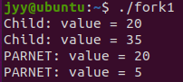
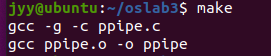
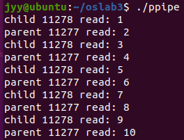
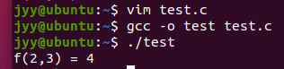

# 实验三 进程通信实验


### 任务一：阅读文档Linux中fork()函数详解，了解如何编程实现进程创建。

-------

### Linux 中 fork() 函数详解

#### 一、fork() 入门知识

fork() 函数用于创建一个新进程（子进程），这个新进程是调用 fork() 的进程（父进程）的副本。调用 fork() 后，父进程和子进程可以分别执行不同的代码路径。fork() 的返回值在父进程和子进程中是不同的：

1. 在父进程中，fork() 返回新创建子进程的进程 ID。
2. 在子进程中，fork() 返回 0。
3. 如果出现错误，fork() 返回一个负值。

以下是一个简单的示例代码：

```c
#include <stdio.h>
#include <unistd.h>

int main() {
    pid_t fpid;
    fpid = fork();
    if (fpid < 0) {
        printf("Error in fork!\n");
    } else if (fpid == 0) {
        printf("I am the child process, my process ID is %d\n", getpid());
    } else {
        printf("I am the parent process, my process ID is %d\n", getpid());
    }
    return 0;
}
```

运行结果可能是：

```
I am the child process, my process ID is 5574
I am the parent process, my process ID is 5573
```

#### 二、fork() 进阶知识

通过多次调用 fork() 可以创建多个进程。例如，以下代码中每次循环调用 fork()：

```c
#include <stdio.h>
#include <unistd.h>

int main() {
    pid_t fpid;
    int count = 0;
    for (int i = 0; i < 2; i++) {
        fpid = fork();
        if (fpid == 0) {
            printf("i = %d, I am the child process, my process ID is %d\n", i, getpid());
        } else {
            printf("i = %d, I am the parent process, my process ID is %d\n", i, getpid());
        }
    }
    return 0;
}
```

运行结果可能是：

```
i = 0, I am the parent process, my process ID is 2043
i = 0, I am the child process, my process ID is 3224
i = 1, I am the parent process, my process ID is 2043
i = 1, I am the child process, my process ID is 3225
```

#### 三、fork() 高阶知识

1. **进程创建和调度**：fork() 之后，父子进程由操作系统调度，执行顺序不确定。
2. **孤儿进程**：如果父进程先退出，子进程会变为孤儿进程，init 进程（PID 1）会收养它们。
3. **僵尸进程**：子进程退出但父进程未调用 wait()，子进程会变为僵尸进程，占用系统资源。父进程应使用 wait() 或 waitpid() 回收子进程资源。

### 任务二：输入代码并观察、解释输出结果。 fork1.c，看注释思考问题。

------------------

```fork1.c
#include <sys/types.h>
#include <stdio.h>
//#include <unistd.h>
#include <stdlib.h>

int value=5;     //where?

int main(){
	

	int i;     //where?
	
	pid_t pid;
	
	for(i=0;i<2;i++){    // How many new processes and printfs？
	

		pid=fork();
	
		if(pid==0){
			value += 15;
			printf("Child: value = %d\n",value);
		}
		else if(pid>0){
			wait(NULL);
			printf("PARNET: value = %d\n",value);
			exit(0);   //Notice：What will happen with or without this line?
		}
	}

}
```

运行结果如下：



关于注释中提到的问题：

1.`int value=5;     //where?`

答：在全局变量区

2.`int i;     //where?`

答：在main函数的局部变量区

3.`for(i=0;i<2;i++){    // How many new processes and printfs？`

答：创建2个新进程，总共会有4个printf输出

4.`exit(0);   //Notice：What will happen with or without this line?`

答：有这个exit(0)语句时，父进程在第一次fork后直接退出，第二次循环不会执行。没有这个exit(0)语句时，父进程会继续第二次循环并再次fork。

### 任务三：掌握如何通过管道实现进程间通信

--------

#### （1）. 阅读⽰例的代码，编译执⾏，并加以理解

新建ppipe.c文件代码如下：

```
#include <stdio.h>
#include <unistd.h>
#include <stdlib.h>
int main(int argc, char *argv[]) {
int pid;
int pipe1[2];
int pipe2[2];
int x;
// 创建第一个管道，用于父进程向子进程发送数据
if (pipe(pipe1) < 0) {
perror("failed to create pipe1");
exit(EXIT_FAILURE);
}
// 创建第二个管道，用于子进程向父进程发送数据
if (pipe(pipe2) < 0) {
perror("failed to create pipe2");
exit(EXIT_FAILURE);}
// 创建子进程
pid = fork();
if (pid < 0) {
perror("failed to create new process");
exit(EXIT_FAILURE);
} else if (pid == 0) {
// 子进程代码
// ⼦进程=>⽗进程：⼦进程通过pipe2[1]进⾏写
// ⼦进程<=⽗进程：⼦进程通过pipe1[0]读
// 因此，在⼦进程中将pipe1[1]和pipe2[0]关闭
close(pipe1[1]);// 子进程不需要向pipe1写数据
close(pipe2[0]);// 子进程不需要从pipe2读数据
do {
 // 从pipe1读取父进程发送的数据
read(pipe1[0], &x, sizeof(int));
printf("child %d read: %d\n", getpid(), x++);
// 增加x并通过pipe2发送回父进程
write(pipe2[1], &x, sizeof(int));
} while (x <= 9);
// 关闭剩下的管道端口
close(pipe1[0]);
close(pipe2[1]);
} else {
// ⽗进程<=⼦进程:⽗进程从pipe2[0]读取⼦进程传过来的数
// ⽗进程=>⼦进程:⽗进程将更新的值通过pipe1[1]写入，传给⼦进程
// 因此，⽗进程会先关闭pipe1[0]和pipe2[1]端⼝
close(pipe1[0]);// 父进程不需要从pipe1读数据
close(pipe2[1]);// 父进程不需要向pipe2写数据
x = 1;
do {
// 发送x到pipe1，供子进程读取
write(pipe1[1], &x, sizeof(int));
// 从pipe2读取子进程发送回来的数据
read(pipe2[0], &x, sizeof(int));
printf("parent %d read: %d\n", getpid(), x++);
} while (x <= 9);
// 关闭剩下的管道端口
close(pipe1[1]);
close(pipe2[0]);
}
return EXIT_SUCCESS;
}
```

接下来新建一个makefile文件，内容如下

```
srcs=ppipe.c
objs=ppipe.o
opts=-g -c

all: ppipe

ppipe: $(objs)
	gcc $(objs) -o ppipe

ppipe.o: $(srcs)
	gcc $(opts) $(srcs)

clean:
	rm ppipe *.o
```

使用`make`命令后显示如下

接下来只需要使用./ppipe 来运行即可，结果如下


这部分代码是⼀段由并发的⽗⼦进程合作将整数X的值从1加到10的⽰意程序。其中的⽗⼦进程开展协作时，两者之间通
过管道进⾏通信。由如下几步过程实现（具体位置已经以注释的形式显示在代码中）

- **管道创建**：通过`pipe(pipe1)`和`pipe(pipe2)`分别创建两个管道。每个管道由两个文件描述符组成，`pipe1[0]`和`pipe1[1]`，`pipe2[0]`和`pipe2[1]`。`pipe1[0]`用于从管道中读取数据，`pipe1[1]`用于向管道中写入数据，`pipe2`同理。
- **进程创建**：使用`fork()`创建一个子进程。父进程和子进程将共享这两个管道。
- **管道端口关闭**：
  - 子进程中，关闭`pipe1[1]`（子进程不需要写入`pipe1`）和`pipe2[0]`（子进程不需要读取`pipe2`）。
  - 父进程中，关闭`pipe1[0]`（父进程不需要读取`pipe1`）和`pipe2[1]`（父进程不需要写入`pipe2`）。
- **数据传输**：
  - 子进程从`pipe1[0]`读取数据，处理后通过`pipe2[1]`发送回父进程。
  - 父进程通过`pipe1[1]`发送数据，读取子进程通过`pipe2[0]`返回的数据。

#### （2）.完成独立实验

设有⼆元函数 f(x,y) = f(x) + f(y)， 其中：
f(x) = f(x-1)*x (x>1)
f(x) = 1 (x=1)
f(y) = f(y-1) + f(y-2) (y>2)
f(y) = 1 (y=1,2)

实现代码如下：

```原创代码
#include <stdio.h>  
#include <stdlib.h>  
#include <unistd.h>  
#include <sys/wait.h>  

int f_x(int x) {  
    if (x == 1) return 1;  
    return f_x(x - 1) * x;  
} 
int f_y(int y) {  
    if (y == 1 || y == 2) return 1;  
    return f_y(y - 1) + f_y(y - 2);  
}  

int main() {  
    int x = 2, y = 3;   
    int fds_x[2], fds_y[2];  
    pid_t pid_x, pid_y;  
 
    pipe(fds_x);  
    pipe(fds_y);  
       
    pid_x = fork();  
    if (pid_x == 0) {   
        close(fds_x[0]);  
        int result_x = f_x(x);  
        write(fds_x[1], &result_x, sizeof(result_x));  
        close(fds_x[1]);   
        exit(0);  
    }  
        
    pid_y = fork();  
    if (pid_y == 0) {    
        close(fds_y[0]);   
        int result_y = f_y(y);  
        write(fds_y[1], &result_y, sizeof(result_y));  
        close(fds_y[1]);  
        exit(0);  
    }  
       
    int result_x, result_y;  
    waitpid(pid_x, NULL, 0);  
    read(fds_x[0], &result_x, sizeof(result_x));  
    close(fds_x[0]); 
      
    waitpid(pid_y, NULL, 0);  
    read(fds_y[0], &result_y, sizeof(result_y));  
    close(fds_y[0]);   
      
    int result_xy = result_x + result_y;  
    printf("f(%d,%d) = %d\n", x, y, result_xy);  
      
    close(fds_x[1]);  
    close(fds_y[1]);  
      
    return 0;  

}
```

执行结果如下：



思路同上面ppipe.c,此处不再赘述。

