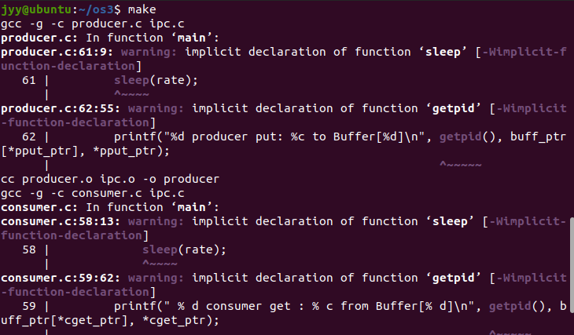
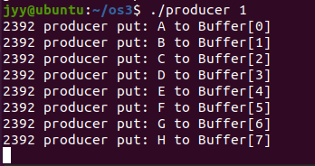
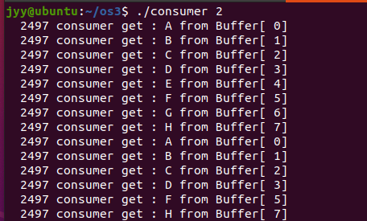
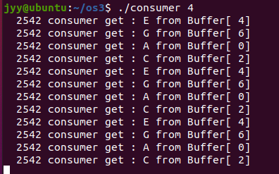
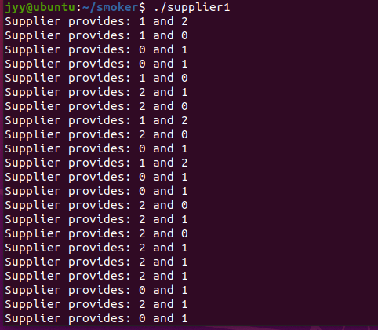
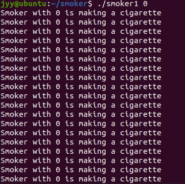
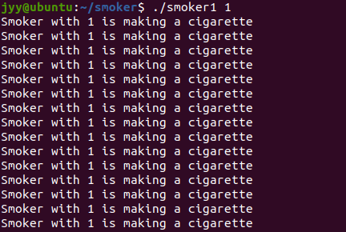
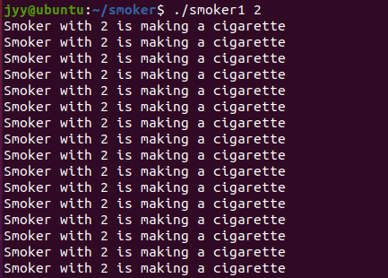

# 实验四、进程同步实验

### 1.示例实验

-------------------

#### 实验介绍：

该示例实验用于模拟多个生产/消费者在有界缓冲上正确的操作。它利用N 个字节的共享内存作为有界循环缓冲区，利用写一字符模拟放一个产品，利用读一字符模拟消费一个产品。当缓冲区空时消费者应阻塞睡眠，而当缓冲区满时生产者应当阻塞睡眠。一旦缓冲区中有空单元，生产者进程就向空单元中入写字符,并报告写的内容和位置。一旦缓冲区中有未读过的字符，消费者进程就从该单元中读出字符，并报告读取位置。生产者不能向同一单元中连续写两次以上相同的字符，消费者也不能从同一单元中连续读两次以上相同的字符。

#### 实验步骤：

1.在当前新建文件夹中建立以下名为 ipc..h 的 C 程序的头文件，该文件中定义了生产者/消费者共用的 IPC 函数的原型和变量：

```
#pragma once
/*

  *  Filename          :  ipc.h
  *  copyright         : (C) 2006 by zhonghonglie
   *  Function          : 声明IPC机制的函数原型和全局变量
      */
      #include <stdio.h> 
      #include <stdlib.h> 
      #include <sys/types.h> 
      #include <sys/ipc.h> 
      #include <sys/shm.h>
      #include <sys/sem.h> 
      #include <sys/msg.h> 

#define BUFSZ   256  

//建立或获取ipc的一组函数的原型说明 

int get_ipc_id(char* proc_file, key_t key);

char* set_shm(key_t shm_key, int shm_num, int shm_flag);

int set_msq(key_t msq_key, int msq_flag);

int set_sem(key_t sem_key, int sem_val, int sem_flag);
int down(int sem_id);

int up(int sem_id);

/*信号灯控制用的共同体*/
typedef union semuns {
    int val;
} Sem_uns;

/* 消息结构体*/
typedef struct msgbuf {
    long mtype;
    char mtext[1];
} Msg_buf;

//生产消费者共享缓冲区即其有关的变量 
extern key_t buff_key;
extern int buff_num;
extern char* buff_ptr;

//生产者放产品位置的共享指针 
extern key_t pput_key;
extern int pput_num;
extern int* pput_ptr;

//消费者取产品位置的共享指针 
extern key_t cget_key;
extern int cget_num;
extern int* cget_ptr;

//生产者有关的信号量 
extern key_t prod_key;
extern key_t pmtx_key;
extern int prod_sem;
extern int pmtx_sem;

//消费者有关的信号量 
extern key_t cons_key;
extern key_t cmtx_key;
extern int cons_sem;
extern int cmtx_sem;

extern int sem_val;
extern int sem_flg;
extern int shm_flg;
```

2. 在当前新建文件夹中建立以下名为 ipc.c 的 C 程序，该程序中定义了生产者/消费者共用的 IPC 函数：

  ```
  /*
  
    *  Filename          :  ipc.c
    *  copyright         : (C) 2006 by zhonghonglie
     *  Function          : 一组建立IPC机制的函数
        */
        #include "ipc.h" 
        /*
     *  get_ipc_id() 从/proc/sysvipc/文件系统中获取IPC的id号
     *  pfile: 对应/proc/sysvipc/目录中的IPC文件分别为
     *  msg-消息队列,sem-信号量,shm-共享内存
     *  key:   对应要获取的IPC的id号的键值
        */
  
  //生产消费者共享缓冲区即其有关的变量 
  key_t buff_key;
  int buff_num;
  char* buff_ptr;
  
  //生产者放产品位置的共享指针 
  key_t pput_key;
  int pput_num;
  int* pput_ptr;
  
  //消费者取产品位置的共享指针 
  key_t cget_key;
  int cget_num;
  int* cget_ptr;
  
  //生产者有关的信号量 
  key_t prod_key;
  key_t pmtx_key;
  int prod_sem;
  int pmtx_sem;
  
  //消费者有关的信号量 
  key_t cons_key;
  key_t cmtx_key;
  int cons_sem;
  int cmtx_sem;
  
  int sem_val;
  int sem_flg;
  int shm_flg;
  
  int get_ipc_id(char* proc_file, key_t key)
  {
      FILE* pf;
      int i, j;
      char line[BUFSZ], colum[BUFSZ];
  
      if ((pf = fopen(proc_file, "r")) == NULL) {
          perror("Proc file not open");
          exit(EXIT_FAILURE);
      }
      fgets(line, BUFSZ, pf);
      while (!feof(pf)) {
          i = j = 0;
          fgets(line, BUFSZ, pf);
          while (line[i] == ' ') i++;
          while (line[i] != ' ') colum[j++] = line[i++];
          colum[j] = '\0';
          if (atoi(colum) != key) continue;
          j = 0;
          while (line[i] == ' ') i++;
          while (line[i] != ' ') colum[j++] = line[i++];
          colum[j] = '\0';
          i = atoi(colum);
          fclose(pf);
          return i;
      }
      fclose(pf);
      return -1;
  
  }
  /*
  
   * 信号灯上的down/up操作
   * semid:信号灯数组标识符
   * semnum:信号灯数组下标
   * buf:操作信号灯的结构
     */
     int down(int sem_id)
     {
      struct sembuf buf;
      buf.sem_op = -1;
      buf.sem_num = 0;
      buf.sem_flg = SEM_UNDO;
      if ((semop(sem_id, &buf, 1)) < 0) {
          perror("down error ");
          exit(EXIT_FAILURE);
      }
      return EXIT_SUCCESS;
     }
  
  int up(int sem_id)
  {
      struct sembuf buf;
      buf.sem_op = 1;
      buf.sem_num = 0;
      buf.sem_flg = SEM_UNDO;
      if ((semop(sem_id, &buf, 1)) < 0) {
          perror("up error ");
          exit(EXIT_FAILURE);
      }
      return EXIT_SUCCESS;
  }
  
  /*
  
  * set_sem函数建立一个具有n个信号灯的信号量
  
  * 如果建立成功，返回 一个信号灯数组的标识符sem_id
  
  * 输入参数：
  
  * sem_key 信号灯数组的键值
  
  * sem_val 信号灯数组中信号灯的个数
  
  * sem_flag 信号等数组的存取权限
    */
    int set_sem(key_t sem_key, int sem_val, int sem_flg)
    {
    int sem_id;
    Sem_uns sem_arg;
  
    //测试由sem_key标识的信号灯数组是否已经建立 
    if ((sem_id = get_ipc_id("/proc/sysvipc/sem", sem_key)) < 0)
    {
        //semget新建一个信号灯,其标号返回到sem_id 
        if ((sem_id = semget(sem_key, 1, sem_flg)) < 0)
        {
            perror("semaphore create error");
            exit(EXIT_FAILURE);
        }
            //设置信号灯的初值 
            sem_arg.val = sem_val;
        if (semctl(sem_id, 0, SETVAL, sem_arg) < 0)
        {
            perror("semaphore set error");
            exit(EXIT_FAILURE);
        }
    }
  
    return sem_id;
    }
  
  /*
  
  * set_shm函数建立一个具有n个字节 的共享内存区
  
  * 如果建立成功，返回 一个指向该内存区首地址的指针shm_buf
  
  * 输入参数：
  
  * shm_key 共享内存的键值
  
  * shm_val 共享内存字节的长度
  
  * shm_flag 共享内存的存取权限
    */
    char* set_shm(key_t shm_key, int shm_num, int shm_flg)
    {
    int i, shm_id;
    char* shm_buf;
  
    //测试由shm_key标识的共享内存区是否已经建立 
    if ((shm_id = get_ipc_id("/proc/sysvipc/shm", shm_key)) < 0)
    {
        //shmget新建 一个长度为shm_num字节的共享内存,其标号返回到shm_id 
        if ((shm_id = shmget(shm_key, shm_num, shm_flg)) < 0)
        {
            perror("shareMemory set error");
            exit(EXIT_FAILURE);
        }
        //shmat将由shm_id标识的共享内存附加给指针shm_buf 
        if ((shm_buf = (char*)shmat(shm_id, 0, 0)) < (char*)0)
        {
            perror("get shareMemory error");
            exit(EXIT_FAILURE);
        }
        for (i = 0; i < shm_num; i++) shm_buf[i] = 0; //初始为0 
    }
    //shm_key标识的共享内存区已经建立,将由shm_id标识的共享内存附加给指针shm_buf
        if ((shm_buf = (char*)shmat(shm_id, 0, 0)) < (char*)0)
        {
            perror("get shareMemory error");
                exit(EXIT_FAILURE);
        }
  
    return shm_buf;
    }
  
  /*
  
  * set_msq函数建立一个消息队列
  
  * 如果建立成功，返回 一个消息队列的标识符msq_id
  
  * 输入参数：
  
  * msq_key 消息队列的键值
  
  * msq_flag 消息队列的存取权限
    */
    int set_msq(key_t msq_key, int msq_flg)
    {
    int msq_id;
  
    //测试由msq_key标识的消息队列是否已经建立 
    if ((msq_id = get_ipc_id("/proc/sysvipc/msg", msq_key)) < 0)
    {
        //msgget新建一个消息队列,其标号返回到msq_id 
        if ((msq_id = msgget(msq_key, msq_flg)) < 0)
        {
            perror("messageQueue set error");
            exit(EXIT_FAILURE);
        }
    }
    return msq_id;
    }
  ```

  3.在当前新文件夹中建立生产者程序producer.c

  ```
  /*
  
    *  Filename    : producer.c
    *  copyright          : (C) 2006 by zhonghonglie
    *  Function           : 建立并模拟生产者进程
       */
  
  #include "ipc.h" 
  
  int main(int argc, char* argv[])
  {
      int rate;
      //可在在命令行第一参数指定一个进程睡眠秒数，以调解进程执行速度 
      if (argv[1] != NULL)  rate = atoi(argv[1]);
      else rate = 3;  //不指定为3秒 
  
      //共享内存使用的变量 
      buff_key = 101;//缓冲区任给的键值 
      buff_num = 8;//缓冲区任给的长度 
      pput_key = 102;//生产者放产品指针的键值 
      pput_num = 1; //指针数 
      shm_flg = IPC_CREAT | 0644;//共享内存读写权限 
      
      //获取缓冲区使用的共享内存，buff_ptr指向缓冲区首地址 
      buff_ptr = (char*)set_shm(buff_key, buff_num, shm_flg);
      //获取生产者放产品位置指针pput_ptr 
      pput_ptr = (int*)set_shm(pput_key, pput_num, shm_flg);
  
  
      //信号量使用的变量 
      prod_key = 201;//生产者同步信号灯键值 
      pmtx_key = 202;//生产者互斥信号灯键值 
      cons_key = 301;//消费者同步信号灯键值 
      cmtx_key = 302;//消费者互斥信号灯键值 
      sem_flg = IPC_CREAT | 0644;
      
      //生产者同步信号灯初值设为缓冲区最大可用量 
      sem_val = buff_num;
      //获取生产者同步信号灯，引用标识存prod_sem 
      prod_sem = set_sem(prod_key, sem_val, sem_flg);
      
      //消费者初始无产品可取，同步信号灯初值设为0 
      sem_val = 0;
      //获取消费者同步信号灯，引用标识存cons_sem 
      cons_sem = set_sem(cons_key, sem_val, sem_flg);
      
      //生产者互斥信号灯初值为1 
      sem_val = 1;
      //获取生产者互斥信号灯，引用标识存pmtx_sem     
      pmtx_sem = set_sem(pmtx_key, sem_val, sem_flg);
      
      //循环执行模拟生产者不断放产品  
      while (1) {
          //如果缓冲区满则生产者阻塞 
          down(prod_sem);
          //如果另一生产者正在放产品，本生产者阻塞 
          down(pmtx_sem);
      
          //用写一字符的形式模拟生产者放产品，报告本进程号和放入的字符及存放的位置
              buff_ptr[*pput_ptr] = 'A' + *pput_ptr;
          sleep(rate);
          printf("%d producer put: %c to Buffer[%d]\n", getpid(), buff_ptr[*pput_ptr], *pput_ptr);
      
              //存放位置循环下移 
              *pput_ptr = (*pput_ptr + 1) % buff_num;
      
          //唤醒阻塞的生产者 
          up(pmtx_sem);
          //唤醒阻塞的消费者 
          up(cons_sem);
      }
      
      return EXIT_SUCCESS;
  
  }
  ```

  4.在当前新文件夹中建立消费者程序consumer.c

```
/*
    Filename   : consumer.c
    copyright   : (C) by zhanghonglie
    Function    : 建立并模拟消费者进程
*/

#include "ipc.h" 

int main(int argc, char* argv[])
{
    int rate;
    //可在在命令行第一参数指定一个进程睡眠秒数，以调解进程执行速度 
    if (argv[1] != NULL)  rate = atoi(argv[1]);
    else rate = 3;  //不指定为3秒 

    //共享内存 使用的变量 
    buff_key = 101; //缓冲区任给的键值 
    buff_num = 8;   //缓冲区任给的长度 
    cget_key = 103; //消费者取产品指针的键值 
    cget_num = 1;   //指针数 
    shm_flg = IPC_CREAT | 0644; //共享内存读写权限 
    
    //获取缓冲区使用的共享内存，buff_ptr指向缓冲区首地址 
    buff_ptr = (char*)set_shm(buff_key, buff_num, shm_flg);
    //获取消费者取产品指针，cget_ptr指向索引地址 
    cget_ptr = (int*)set_shm(cget_key, cget_num, shm_flg);
    
    //信号量使用的变量 
    prod_key = 201;  //生产者同步信号灯键值 
    pmtx_key = 202;  //生产者互斥信号灯键值 
    cons_key = 301;  //消费者同步信号灯键值 
    cmtx_key = 302;  //消费者互斥信号灯键值 
    sem_flg = IPC_CREAT | 0644; //信号灯操作权限 
    
        //生产者同步信号灯初值设为缓冲区最大可用量 
        sem_val = buff_num;
    //获取生产者同步信号灯，引用标识存prod_sem 
    prod_sem = set_sem(prod_key, sem_val, sem_flg);
    
    //消费者初始无产品可取，同步信号灯初值设为0 
    sem_val = 0;
    //获取消费者同步信号灯，引用标识存cons_sem 
    cons_sem = set_sem(cons_key, sem_val, sem_flg);
    
    //消费者互斥信号灯初值为1 
    sem_val = 1;
    //获取消费者互斥信号灯，引用标识存pmtx_sem     
    cmtx_sem = set_sem(cmtx_key, sem_val, sem_flg);
    
    //循环执行模拟消费者不断取产品  
    while (1) {
        //如果无产品消费者阻塞 
        down(cons_sem);
        //如果另一消费者正在取产品，本消费者阻塞 
        down(cmtx_sem);
    
        //用读一字符的形式模拟消费者取产品，报告本进程号和获取的字符及读取的位置
            sleep(rate);
        printf(" % d consumer get : % c from Buffer[% d]\n", getpid(), buff_ptr[*cget_ptr], *cget_ptr);
            //读取位置循环下移 
            * cget_ptr = (*cget_ptr + 1) % buff_num;
    
        //唤醒阻塞的消费者 
        up(cmtx_sem);
        //唤醒阻塞的生产者 
        up(prod_sem);
    }
    
    return EXIT_SUCCESS;

}
```

5.在当前文件夹中建立Makefile 项目管理文件

```
hdrs = ipc.h
opts = -g -c
c_src = consumer.c ipc.c
c_obj = consumer.o ipc.o
p_src = producer.c ipc.c
p_obj = producer.o ipc.o

all : producer consumer

consumer : $(c_obj)
gcc $(c_obj) -o consumer
consumer.o : $(c_src) $(hdrs)
gcc $(opts) $(c_src)

producer : $(p_obj)
gcc $(p_obj) -o producer
producer.o : $(p_src) $(hdrs)
gcc $(opts) $(p_src)
clean :
	rm consumer producer * .o
```

6.使用make 命令编译连接生成可执行的生产者、消费者程序

`gmake`
`gcc -g -c producer.c ipc.c`
`gcc producer.o ipc.o -o producer`
`gcc -g -c consumer.c ipc.c`
`gcc consumer.o ipc.o -o consumer`

笔者在使用gmake命令后遇到了如下的问题，切换成make命令时又遇到了如下问题


这是因为makefile的第11，13，16，18行需要删除空格用tab开头，修改后结果如下：



7.在当前终端窗体中启动执行速率为1 秒的一个生产者进程

输入：`./producer 1`



8. 打开另一终端窗体，进入当前工作目录，从中再启动另一执行速率为3 的生产
   者进程:

`./producer 3`


可以看到该生产者进程因为缓冲区已满而立即阻塞。

9.再打开另外两个终端窗体，进入当前工作目录，从中启动执行速率为2 和4 的两
个消费者进程:

`./consumer 2`

`./consumer 4`





当我们用ctrl+C 将两生产者进程打断或者用ctrl+C 将两消费者进程打断后，另外两者就会因在读空或写满缓冲区后而阻塞


通过这个例子我们可以理解如下**进程间通信 (IPC)**的原理，在本实验中，使用了共享内存和信号灯作为 IPC 机制：

- **共享内存**：用于在供应者和抽烟者进程之间共享材料信息。通过 `shmget` 创建共享内存段，通过 `shmat` 连接到共享内存段，并通过 `shmdt` 和 `shmctl` 进行分离和删除。
- **信号灯 (Semaphore)**：用于同步进程间对共享资源（共享内存）的访问，避免竞争条件。信号灯通过 `semget` 创建，通过 `semop` 实现 P 和 V 操作，通过 `semctl` 初始化和删除。

## 2.独立实验

-------

抽烟者问题。假设一个系统中有三个抽烟者进程，每个抽烟者不断地卷烟并抽烟。抽烟者卷起并抽掉一颗烟需要有三种材料：烟草、纸和胶水。一个抽烟者有烟草，一个有纸，另一个有胶水。系统中还有一个供应者进程，它无限地供应所有三种材料，但每次仅轮流提供三种材料中的两种。得到缺失的两种材料的抽烟者在卷起并抽掉一颗烟后会发信号通知供应者，让它继续提供另外的两种材料。这一过程重复进行。 请用以上介绍的IPC 同步机制编程，实现该问题要求的功能。

我们先从原理上解决这个问题：

为了解决这个问题，可以使用进程间通信（IPC）中的信号量（semaphore）机制来实现并发进程的同步和互斥。

1.首先，我们应该准备好同步和互斥的条件，

- `材料供应信号量（supply_sem）`：初始值为0，用于控制供应者提供材料的操作。
- `抽烟者信号量（smoker_sem）`：每个抽烟者对应一个信号量，初始值为0，用于通知供应者某个抽烟者已经抽完烟。

2.然后我们就可以开始准备供应者和吸烟者的功能实现

**供应者进程的工作流程如下：**

1. 轮流提供两种材料。
2. 等待抽烟者完成抽烟，接收通知后再继续提供新的材料。

**具体步骤如下：**

- 等待所有抽烟者信号量均为0，即所有抽烟者处于等待状态。
- 随机选择两种材料，更新供应信号量
- 等待被唤醒的抽烟者发出完成信号，然后重复上述过程。

**每个抽烟者进程的工作流程如下：**

1. 等待供应者提供所需的两种材料。
2. 收到材料后，模拟卷烟和抽烟的过程。
3. 抽完烟后，通知供应者自己已经完成，并再次等待下一轮材料。

**具体步骤如下：**

- 等待供应者提供的信号量变为1，即当前材料组合可用。
- 模拟卷烟和抽烟操作。
- 向供应者发送信号，通知已经完成，供应者可以继续提供新的材料。
- 继续等待下一轮材料。

具体代码实现如下：

**ipc.h**

```
cCopy code#ifndef IPC_H
#define IPC_H

#include <stdio.h>
#include <stdlib.h>
#include <sys/types.h>
#include <sys/ipc.h>
#include <sys/shm.h>
#include <sys/sem.h>
#include <sys/msg.h>

key_t shm_key;
key_t sem_key;
int shm_id;
int sem_id;

typedef enum { TOBACCO, PAPER, MATCH } material_t;

typedef struct {
    material_t materials[2];
    int ready;
} shm_data_t;

shm_data_t *shm_data;

void sem_down(int sem_id);
void sem_up(int sem_id);

void init_ipc();
void cleanup_ipc();

#endif // IPC_H
```

**ipc.c**

```
cCopy code#include "ipc.h"

void sem_down(int sem_id) {
    struct sembuf sem_op = {0, -1, SEM_UNDO};
    if (semop(sem_id, &sem_op, 1) < 0) {
        perror("sem_down failed");
        exit(EXIT_FAILURE);
    }
}

void sem_up(int sem_id) {
    struct sembuf sem_op = {0, 1, SEM_UNDO};
    if (semop(sem_id, &sem_op, 1) < 0) {
        perror("sem_up failed");
        exit(EXIT_FAILURE);
    }
}

void init_ipc() {
    shm_key = 1234;
    sem_key = 5678;

    shm_id = shmget(shm_key, sizeof(shm_data_t), IPC_CREAT | 0666);
    if (shm_id < 0) {
        perror("shmget failed");
        exit(EXIT_FAILURE);
    }

    shm_data = (shm_data_t *)shmat(shm_id, NULL, 0);
    if (shm_data == (void *)-1) {
        perror("shmat failed");
        exit(EXIT_FAILURE);
    }

    sem_id = semget(sem_key, 1, IPC_CREAT | 0666);
    if (sem_id < 0) {
        perror("semget failed");
        exit(EXIT_FAILURE);
    }

    semctl(sem_id, 0, SETVAL, 1);  // 初始化信号量为1
}

void cleanup_ipc() {
    shmdt(shm_data);
    shmctl(shm_id, IPC_RMID, NULL);
    semctl(sem_id, 0, IPC_RMID);
}
```

**smoker.c**

```
cCopy code#include "ipc.h"
#include <unistd.h>  // 确保包含unistd.h

void smoker(material_t my_material) {
    while (1) {
        sem_down(sem_id);
        //printf("Smoker %d: Got semaphore\n", my_material);
        if (shm_data->ready) {
            if (shm_data->materials[0] != my_material && shm_data->materials[1] != my_material) {
                printf("Smoker with %d is making a cigarette\n", my_material);
                shm_data->ready = 0;
                sem_up(sem_id);
               // printf("Smoker %d: Released semaphore\n", my_material);
                sleep(1);
                continue;
            }
        }
        sem_up(sem_id);
        //printf("Smoker %d: Released semaphore\n", my_material);
        sleep(1);
    }
}

int main(int argc, char *argv[]) {
    if (argc != 2) {
        fprintf(stderr, "Usage: %s <material>\n", argv[0]);
        exit(EXIT_FAILURE);
    }

    material_t my_material = atoi(argv[1]);
    init_ipc();
    smoker(my_material);
    cleanup_ipc();
    return 0;
}
```

**supplier.c**

```
cCopy code#include "ipc.h"
#include <unistd.h>  // 确保包含unistd.h
#include <stdlib.h>
#include <time.h>

void supplier() {
    material_t materials[3] = {TOBACCO, PAPER, MATCH};
    int i, j;

    srand(time(NULL));  // 初始化随机数生成器

    while (1) {
        sem_down(sem_id);
       // printf("Supplier: Got semaphore\n");
        if (!shm_data->ready) {
            i = rand() % 3;
            j = (i + 1 + rand() % 2) % 3;
            shm_data->materials[0] = materials[i];
            shm_data->materials[1] = materials[j];
            shm_data->ready = 1;
            printf("Supplier provides: %d and %d\n", materials[i], materials[j]);
        }
        sem_up(sem_id);
       // printf("Supplier: Released semaphore\n");
        sleep(1);
    }
}

int main() {
    init_ipc();
    supplier();
    cleanup_ipc();
    return 0;
}
```

**Makefile**

```
makefileCopy codeCC = gcc
CFLAGS = -g -Wall
TARGETS = smoker supplier

all: $(TARGETS)

smoker: smoker.o ipc.o
    $(CC) $(CFLAGS) -o smoker smoker.o ipc.o

supplier: supplier.o ipc.o
    $(CC) $(CFLAGS) -o supplier supplier.o ipc.o

smoker.o: smoker.c ipc.h
    $(CC) $(CFLAGS) -c smoker.c

supplier.o: supplier.c ipc.h
    $(CC) $(CFLAGS) -c supplier.c

ipc.o: ipc.c ipc.h
    $(CC) $(CFLAGS) -c ipc.c

clean:
    rm -f $(TARGETS) *.o
```

通过在终端输入`make`来完成编译

然后在终端输入`./supplier`来启动供应者在三个新的终端`./smoker 0  ./smoker 1  ./smoker 2`

结果如下：（注：此时笔者的命名与文章中不同，可以忽略，以文章内容为主）









通过上述的结果展示，我们可以再次回顾之前讲到的一些问题：

##### 1.真实操作系统中提供的并发进程同步机制是怎样实现和解决同步问题

在真实的操作系统中，并发进程的同步问题通常通过进程间通信（IPC）机制来实现。主要的IPC机制包括：

1. **共享内存**：多个进程可以访问同一块内存区域，用于交换数据。共享内存的优点是数据交换速度快，适合大数据量的传输。
2. **信号量（Semaphore）**：用于控制进程对共享资源的访问，通过信号量实现进程的同步与互斥。信号量是一种特殊的变量，可以被多个进程访问和操作。
3. **消息队列**：进程可以通过消息队列发送和接收消息，以实现进程间的数据交换和同步。

##### 2.信号灯机制是怎样完成进程的互斥和同步的？其中信号量的初值和其值的变化的物理意义是什么？

**进程互斥**

- 信号量的初值设为1表示资源可用。
- 当进程进入临界区时，执行`P`操作（也称为`wait`操作），将信号量值减1。如果信号量值为0，则进程阻塞，等待信号量值大于0。
- 当进程离开临界区时，执行`V`操作（也称为`signal`操作），将信号量值加1，唤醒阻塞在该信号量上的一个进程。

**进程同步**

- 信号量用于表示资源的可用数量或某种条件的满足。

- 对于生产者-消费者问题，使用两个信号量

  ```
  empty
  ```

  和

  ```
  full
  ```

  分别表示空缓冲区单元和满缓冲区单元的数量：

  - `empty`的初值设为缓冲区大小，表示所有缓冲区单元初始时都是空的。
  - `full`的初值设为0，表示初始时没有满的缓冲区单元。
  - 生产者在放置产品前执行`P(empty)`，在放置产品后执行`V(full)`。
  - 消费者在获取产品前执行`P(full)`，在获取产品后执行`V(empty)`。

**信号量初值和值的变化的物理意义**

- **初值**：表示资源的初始状态。例如，互斥信号量初值为1表示资源可用；同步信号量`empty`初值为缓冲区大小，表示所有单元可用。

- 值的变化

  ：

  - 信号量的值为正数表示可用资源的数量。
  - 信号量的值为0表示资源不可用或所有资源正在被使用。
  - 信号量的值为负数表示有进程在等待资源，每个等待的进程使信号量的值减1。

#### 3. 使用多于4个的生产者和消费者，以各种不同的启动顺序、不同的执行速率检测以上示例程序和独立实验程序是否都能满足同步的要求

能，因为原因分析

1. **信号量机制的有效应用**：
   - 示例程序和独立实验程序都使用信号量进行进程同步和互斥操作。信号量确保只有在资源可用时，进程才能进行相应操作，否则进程将被阻塞。这有效避免了资源竞争和死锁的发生。
2. **共享内存的正确使用**：
   - 两个程序都使用共享内存来存储生产者和消费者之间共享的数据，或供应者和抽烟者之间共享的材料信息。共享内存的使用确保了数据的一致性和正确性。

---------

本文章已上传github与csdn

github：https://github.com/TADogg/DUT-OS2024

csdn：https://blog.csdn.net/TADog?type=blog