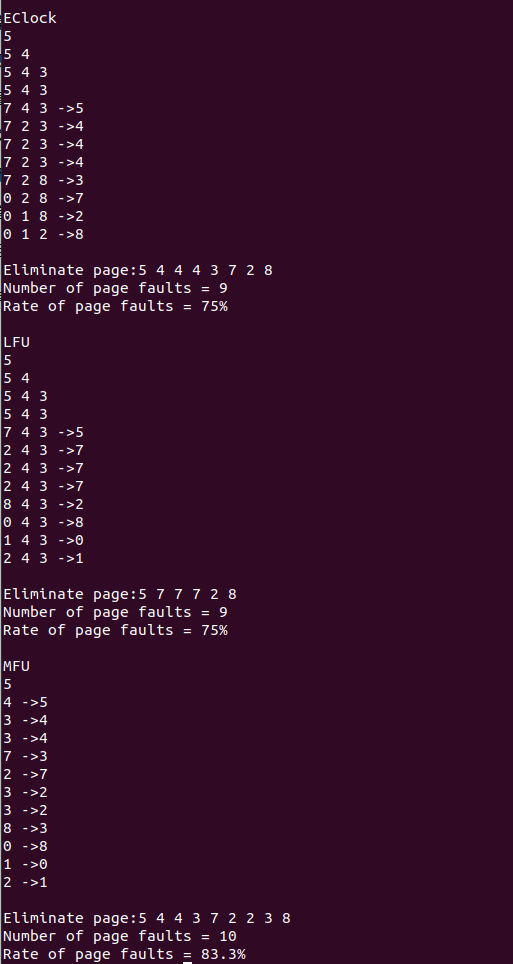

# 实验七：内存页面置换算法实验

## 1.示例实验：模拟两种置换算法

两种算法分别是LRU算法和FIFO算法

如下是代码实现：

#### vmrp.h：

```
/*
Filename    : vmrp.h
*copyright  :(C) 2006 by zhonghonglie
*Function   :声明虚拟内存页置换类
*/
#include<iostream>
#include<iomanip>
#include <malloc.h>

class Replace{
public:
    Replace();
    ~Replace();
    void InitSpace(char*MethodName);//初始化页号记录
    void Report(void); //报告算法执行情况
    void Fifo(void);//先进先出算法
    void Lru(void);//最近最旧未用算法
    void Clock(void);//时钟(二次机会）置换算法
    void Eclock(void);//增强二次机会置换算法
    void Lfu(void);//最不经常使用置换算法
    void Mfu(void);//最经常使用置换算法
private:
    int* ReferencePage;//存放要访问到的页号
    int * EliminatePage;//存放淘汰页号
    int * PageFrames ;//存放当前正在实存中的页号
    int PageNumber;//访问页数
    int FrameNumber;//实存帧数
    int FaultNumber;//失败页数
};
```

#### vmrp.cc

```
/*
Filename    : vmrp.cc
copyright   : (C) 2006 by zhonghonglie
*Function   :模拟虚拟内存页置换算法的程序
*/

#include "vmrp.h"

using namespace std;

Replace::Replace()
{
    int i;
    //设定总得访问页数,并分配相应的引用页号和淘汰页号记录数组空间
    cout << "Please input page numbers :" ;
    cin >> PageNumber;
    ReferencePage = new int [sizeof(int) * PageNumber];
    EliminatePage = new int [sizeof(int) * PageNumber];

    //输入引用页号序列(页面走向),初始化引用页数组
    cout << "Please input reference page string :";
    for (i =0;i<PageNumber;i++)
    {
        cin >>ReferencePage[i];//引用页暂存引用数组
    }

    //设定内存实页数(帧数),并分配相应的实页号记录数组空间(页号栈)
    cout << "Please input page frames :";
    cin>>FrameNumber;
    PageFrames = new int [sizeof(int) * FrameNumber];
}

Replace::~Replace() { }

void Replace::InitSpace(char* MethodName)
{
    int i;
    cout << endl <<MethodName <<endl;
    FaultNumber=0;
    //引用还未开始,-1表示无引用页
    for (i= 0; i< PageNumber; i++)
        EliminatePage[i]=-1;
    for(i= 0; i< FrameNumber; i++)
        PageFrames[i]=-1;
}

//分析统计选择的算法对于当前输入的页面走向的性能
void Replace::Report(void)
{
    //报告淘汰页顺序
    cout << endl <<"Eliminate page:";
    for(int i=0; EliminatePage[i]!=-1; i++) cout<<EliminatePage[i]<<"";
    //报告缺页数和缺页率
    cout<< endl << "Number of page faults = "<< FaultNumber << endl;
    cout << setw(6)<<setprecision(3) ;
    cout << "Rate of page faults = " <<100*(float)FaultNumber/(float)PageNumber <<"%"<<endl;
}

//最近最旧未用置换算法
void Replace::Lru(void)
{
    int i,j,k,l,next;
    InitSpace("LRU");
    //循环装入引用页
    for(k=0,l=0;k <PageNumber; k++)
    {
        next=ReferencePage[k];
        //检测引用页当前是否已在实存
        for (i=0; i<FrameNumber; i++)
        {
            if(next == PageFrames[i])
            {
                //引用页已在实存将其调整到页记录栈顶
                next=PageFrames[i];
                for(j=i;j>0;j--) PageFrames[j] = PageFrames[j-1];
                PageFrames[0]=next;
                break;
            }
        }
        if(PageFrames[0] == next)
        {
            //如果引用页已放栈顶，则为不缺页，报告当前内存页号
            for(j=0; j<FrameNumber; j++)
                if(PageFrames[j]>=0)
                    cout <<PageFrames[j]<<" ";
            cout << endl;
            continue;//继续装入下一页
        }else
            //如果引用页还未放栈顶，则为缺页，缺页数加1
            FaultNumber++;
        //栈底页号记入淘汰页数组中
        EliminatePage[l]= PageFrames[FrameNumber-1];
        //向下压栈
        for(j=FrameNumber-1;j>0;j--) PageFrames[j]=PageFrames[j-1];
        PageFrames[0] = next; //引用页放栈顶
        //报告当前实存中页号
        for(j=0;j<FrameNumber;j++)
            if(PageFrames[j]>=0)
                cout<<PageFrames[j]<<" ";
        if(EliminatePage[l]>=0)
            cout<<"->"<<EliminatePage[l++]<<endl;
        else
            cout<<endl;
    }
    //分析统计选择的算法对于当前引用过的页面走向的性能
    Report();
}

void Replace::Fifo(void)
{
    int i,j,k,l,next;

    InitSpace("FIFO");
    //循环装入引用页
    for(k=0,j=l=0;k<PageNumber;k++)
    {
        next = ReferencePage[k];
        //如果引用页已在实存中，报告实存页号
        for(i=0;i<FrameNumber;i++)
            if(next==PageFrames[i]) break;
        if(i<FrameNumber)
        {
            for(i=0;i<FrameNumber;i++)  cout<<PageFrames[i]<<" ";
            cout<<endl;
            continue;//继续引用下一页
        }
        //引用页不在实存中，缺页数+1
        FaultNumber++;
        EliminatePage[l]=PageFrames[j];//最先入页号记入淘汰页数组
        PageFrames[j]=next;//引用页号放最先入页号处
        j= (j+1)%FrameNumber;//最先入页号循环下移
        //报告当前实存页号和淘汰页号
        for(i=0;i<FrameNumber;i++)
            if(PageFrames[i]>=0) cout<<PageFrames[i]<<" ";
        if(EliminatePage[l]>=0)
            cout<<"->"<<EliminatePage[l++]<<endl;
        else cout<<endl;
    }
    //分析统计选择的算法对于当前引用过的页面走向的性能
    Report();
}

//未实现的其他页置换算法入口
void Replace::Clock(void){ }
void Replace::Eclock (void){ }
void Replace::Lfu(void){ }
void Replace::Mfu(void){ }

int main(int argc,char *argv[])
{
    Replace * vmpr = new Replace();
    vmpr->Lru();
    vmpr->Fifo();
    return 0;
}
```

#### makefile

```
head=vmrp.h
srcs=vmrp.cc
objs=vmrp.o
opts=-w -g -c
all: vmrp
vmrp: $(objs)
	g++ $(objs) -o vmrp

vmrp.o: $(srcs) $(head)
	g++ $(opts) $(srcs)

clean:
	rm vmrp *.o
```

使用make命令编译


3.执行vmpr命令`./vmrp`,输入引用页数12，引用串为belady串，内存页帧数为3


以上输出报告了FIFO和LRU两种算法的页置换情况。其中每一行数字为当前存在实存中的页号，->右边的数字表示当前被淘汰的页号。每种算法最后3行输出为：依次淘汰页号，缺页数，页出错率。

再次执行vmrp，仍然输入Belady串，但是将页帧数改为4


## 2.独立实验：补充增强二次机会等置换算法的模拟程序

代码实现：vmrp.cc

```
#include "vmrp.h"
#include "iostream"

using namespace std;


Replace::Replace(){
    int i;
    // 设置总访问页数，并且分配相应引用页号和淘汰页号记录数组
    cout<<"Please input page numbers:";
    cin>>PageNumber;
    ReferencePage=new int[sizeof(int)*PageNumber];
    EliminatePage=new int[sizeof(int)*PageNumber];

    //输入引用页号序列，初始化引用页数组
    cout<<"Please input reference page string:";
    for(i=0;i<PageNumber;i++)
        cin>>ReferencePage[i];
    
    //设定内存实页数，并且分配相应实页号
    cout<<"Please input page frames:";
    cin>>FrameNumber;
    PageFrames=new int[sizeof(int)*FrameNumber];
}

Replace::~Replace(){
}

void Replace::InitSpace(char*MethodName){
    int i;
    cout<<endl<<MethodName<<endl;
    FaultNumber=0;
    // 引用还没有开始，将这几个数组初始化，用-1表示没有引用页
    for(i=0;i<PageNumber;i++)
        EliminatePage[i]=-1;
    for(i=0;i<FrameNumber;i++)
        PageFrames[i]=-1;
}

//分析并且输出当前选择的算法对于当前输入页面的性能表现
void Replace::Report(void){
    //报告淘汰页顺序
    cout<<endl<<"Eliminate page:";
    for(int i=0;EliminatePage[i]!=-1;i++)
        cout<<EliminatePage[i]<<' ';
    //报告缺页数和缺页率
    cout<<endl<<"Number of page faults="<<FaultNumber<<endl;
    cout<<setw(6)<<setprecision(3);
    cout<<"Rate of page faults ="<<100*(float)FaultNumber/(float)PageNumber<<"%"<<endl;
}

//最近最旧未用算法
void Replace::Lru(void)
{
    int i,j,k,l,next;
    char MethodName[20]="LRU";
    InitSpace(MethodName);
    //将引用页装入
    for(k=0,l=0;k<PageNumber;k++){
        next=ReferencePage[k];
        //检测当前引用页是否已经在实存
        for(i=0;i<FrameNumber;i++){
            if(next==PageFrames[i]){
                //将已经在实存的引用页调整到栈顶
                next=PageFrames[i];
                for(j=i;j>0;j--)
                    PageFrames[j]=PageFrames[j-1];
                PageFrames[0]=next;
                break;
            }
        }
        if(PageFrames[0]==next){
            //如果引用页不缺页，将它放到栈顶之后，报告当前内存页号
            for(j=0;j<FrameNumber;j++)
                if(PageFrames[j]>=0)
                    cout<<PageFrames[j]<<" ";
            cout<<endl;
            continue;// 继续装下一页
        }
        else
            //引用页不在栈顶，即之前没有扫描到，即缺页
            FaultNumber++;
        //栈底页号计入淘汰页数组
        EliminatePage[l]=PageFrames[FrameNumber-1];
        //向下压栈
        for(j=FrameNumber-1;j>0;j--)
            PageFrames[j]=PageFrames[j-1];
        PageFrames[0]=next;//引用页即新来的页放在栈顶
        //报告现在在实存中存在的页号
        for(j=0;j<FrameNumber;j++)
            if(PageFrames[j]>=0)
                cout<<PageFrames[j]<<' ';
        //报告当前已经淘汰的页号
        if(EliminatePage[l]>=0)
            cout<<"->"<<EliminatePage[l++]<<endl;
        else
            cout<<endl;
    }
    Report();
}

//先进先出置换算法
void Replace::Fifo(void)
{
    int i,j,k,l,next;
    char MethodName[20]="FIFO";
    InitSpace(MethodName);
    //循环装入引用页
    for(k = 0,j = l = 0; k < PageNumber; k++) {
        next = ReferencePage[k];
        //如果引用页已在实存中，报告实存页号
        for(i = 0; i < FrameNumber; i++)
            if(next == PageFrames[i])
                break;
        // 如果i<FrameNumber,即引用页在实存中
        if(i < FrameNumber) {
            for(i = 0; i < FrameNumber; i++)
                if(PageFrames[i] >= 0)
                    cout << PageFrames[i] << " ";
            cout << endl;
            continue; // 继续引用下一页
        }

        //引用页不在实存中，缺页数加1
        FaultNumber++;
        EliminatePage[l] = PageFrames[j]; //最先入页号记入淘汰页数组
        PageFrames[j] = next; //引用页号放最先入页号处
        j = (j + 1) % FrameNumber; //最先入页号循环下移

        //报告当前实存页号和淘汰页号
        for(i = 0; i < FrameNumber; i++)
            if(PageFrames[i] >= 0)
                cout << PageFrames[i] << " ";

        if(EliminatePage[l] >= 0)
            cout << "->" << EliminatePage[l++] << endl;
        else
            cout << endl;
    }

    //分析统计选择的算法对于当前引用的页面走向的性能
    Report();
}

void Replace::Clock(void)
{
    int i, j, k, l, next;
    char MethodName[20] = "Clock";
    InitSpace(MethodName);
    bool useBit[FrameNumber] = {false}; // 使用位数组，记录每一页的访问情况
    // 循环装入引用页
    for (k = 0, j = l = 0; k < PageNumber; k++)
    {
        next = ReferencePage[k];
        // 如果引用页已在实存中，报告实存页号，并且置使用位为1
        for (i = 0; i < FrameNumber; i++)
        {
            if (next == PageFrames[i])
            {
                useBit[i] = true; // 设置使用位为1
                break;
            }
        }
        // 如果引用页在实存中，输出实存页号并继续引用下一页
        if (i < FrameNumber)
        {
            for (i = 0; i < FrameNumber; i++)
            {
                if (PageFrames[i] >= 0)
                    cout << PageFrames[i] << " ";
            }
            cout << endl;
            continue;
        }
        // 引用页不在实存中，缺页数加1
        FaultNumber++;
        while (true)
        {
            if (!useBit[j]) // 如果当前帧的使用位为0，则替换该帧
            {
                EliminatePage[l] = PageFrames[j]; // 将被淘汰的页号记录到淘汰页数组
                PageFrames[j] = next;             // 将引用页放入该帧
                useBit[j] = false;                 // 设置使用位为1
                j = (j + 1) % FrameNumber;       // 循环下移指针
                break;
            }
            else // 如果当前帧的使用位为1，则将使用位设置为0，继续查找下一个帧
            {
                useBit[j] = false;
                j = (j + 1) % FrameNumber;// j表示当前指针，每次都从上次地方继续
            }
        }
        // 报告当前实存页号和淘汰页号
        for (i = 0; i < FrameNumber; i++)
        {
            if (PageFrames[i] >= 0)
                cout << PageFrames[i] << " ";
        }
        if (EliminatePage[l] >= 0)
            cout << "->" << EliminatePage[l++] << endl;
        else
            cout << endl;
    }
    // 分析统计选择的算法对于当前引用的页面走向的性能
    Report();
}

void Replace::Eclock(void)
{
    int i, j, k, l, next;
    char MethodName[20] = "Eclock";
    InitSpace(MethodName);
    bool useBit[FrameNumber] = {false}; // 使用位数组，记录每一页的访问情况
    bool modifyBit[FrameNumber] = {false}; // 修改位数组，记录每一页的修改情况
    // 循环装入引用页
    for (k = 0, j = l = 0; k < PageNumber; k++)
    {
        next = ReferencePage[k];
        // 如果引用页已在实存中，报告实存页号，并且置使用位为1
        for (i = 0; i < FrameNumber; i++)
        {
            if (next == PageFrames[i])
            {
                useBit[i] = true; // 设置使用位为1
                break;
            }
        }
        // 如果引用页在实存中，输出实存页号并继续引用下一页
        if (i < FrameNumber)
        {
            for (i = 0; i < FrameNumber; i++)
            {
                if (PageFrames[i] >= 0)
                    cout << PageFrames[i] << " ";
            }
            cout << endl;
            continue;
        }
        // 引用页不在实存中，缺页数加1
        FaultNumber++;
        while(true)
        {            
            if (!useBit[j] && !modifyBit[j])
            {
                EliminatePage[l] = PageFrames[j]; // 将被淘汰的页号记录到淘汰页数组
                PageFrames[j] = next;            // 将引用页放入该帧
                useBit[j] = false;                // 设置使用位为1
                j = (j + 1) % FrameNumber;       // 循环下移指针       
                break;
            }
            else if(!useBit[j] && modifyBit[j]){
                EliminatePage[l] = PageFrames[j]; // 将被淘汰的页号记录到淘汰页数组
                PageFrames[j] = next;            // 将引用页放入该帧
                useBit[j] = false;                // 设置使用位为1
                j = (j + 1) % FrameNumber;      // 循环下移指针
                break;
            }
            else{
                useBit[j]=false;
                j=(j+1)%FrameNumber;
            }            
        }
        // 报告当前实存页号和淘汰页号
        for (i = 0; i < FrameNumber; i++)
        {
            if (PageFrames[i] >= 0)
                cout << PageFrames[i] << " ";
        }
        if (EliminatePage[l] >= 0)
            cout << "->" << EliminatePage[l++] << endl;
        else
            cout << endl;
    }
    // 分析统计选择的算法对于当前引用的页面走向的性能
    Report();
}

void Replace::Lfu(void){
    int i,j,k,l,next;
    int * reference = new int[sizeof(int) * PageNumber];//引用页
    int * freq = new int[FrameNumber]; // 记录每个页面的访问频率
    int min_freq_index;

    char MethodName[20] = "LFU";
    InitSpace(MethodName);

    // 初始化频率
    for(i = 0; i < FrameNumber; i++){
        freq[i] = 0;
    }

    //将引用页装入
    for(k = 0, l = 0; k < PageNumber; k++){
        next = ReferencePage[k];
        // 检测当前引用页是否已经在实存
        for(i = 0; i < FrameNumber; i++){
            if(next == PageFrames[i]){
                freq[i]++; // 更新访问频率
                break;
            }
        }

        if(i < FrameNumber){
            // 如果引用页不缺页，报告当前内存页号
            for(j = 0; j < FrameNumber; j++){
                if(PageFrames[j] >= 0)
                    cout << PageFrames[j] << " ";
            }
            cout << endl;
            continue; // 继续装下一页
        } 
        else {
            // 引用页不在实存中，缺页
            FaultNumber++;
            // 找到访问频率最小的页面
            min_freq_index = 0;
            for(i = 1; i < FrameNumber; i++){
                if(freq[i] < freq[min_freq_index]){
                    min_freq_index = i;
                }
            }

            // 栈底页号计入淘汰页数组
            EliminatePage[l] = PageFrames[min_freq_index];
            // 将新页面加入栈顶
            PageFrames[min_freq_index] = next;
            freq[min_freq_index] = 1; // 新页面的访问频率为1

            // 报告现在在实存中存在的页号
            for(j = 0; j < FrameNumber; j++){
                if(PageFrames[j] >= 0)
                    cout << PageFrames[j] << ' ';
            }

            // 报告当前已经淘汰的页号
            if(EliminatePage[l] >= 0){
                cout << " -> " << EliminatePage[l++] << endl;
            } else {
                cout << endl;
            }
        }
    }
    Report();
}

void Replace::Mfu(void){
    int i,j,k,l,next;
    int * reference = new int[sizeof(int) * PageNumber];//引用页
    int * freq = new int[FrameNumber]; // 记录每个页面的访问频率
    int max_freq_index;
    char MethodName[20] = "MFU";
    InitSpace(MethodName);
    // 初始化频率
    for(i = 0; i < FrameNumber; i++){
        freq[i] = 0;
    }
    //将引用页装入
    for(k = 0, l = 0; k < PageNumber; k++){
        next = ReferencePage[k];
        // 检测当前引用页是否已经在实存
        for(i = 0; i < FrameNumber; i++){
            if(next == PageFrames[i]){
                freq[i]++; // 更新访问频率
                break;
            }
        }
        if(i < FrameNumber){
            // 如果引用页不缺页，报告当前内存页号
            for(j = 0; j < FrameNumber; j++){
                if(PageFrames[j] >= 0)
                    cout << PageFrames[j] << " ";
            }
            cout << endl;
            continue; // 继续装下一页
        } 
        else {
            // 引用页不在实存中，缺页
            FaultNumber++;
            // 找到访问频率最小的页面
            max_freq_index = 0;
            for(i = 1; i < FrameNumber; i++){
                if(freq[i] > freq[max_freq_index]){
                    max_freq_index = i;
                }
            }
            //如果此时页框有剩，将max值替换
            for(i=0;i<FaultNumber;i++){
                if(PageFrames[i]==-1){
                    max_freq_index=i;
                }
            }

            // 栈底页号计入淘汰页数组
            EliminatePage[l] = PageFrames[max_freq_index];
            // 将新页面加入栈顶
            PageFrames[max_freq_index] = next;
            freq[max_freq_index] = 1; // 新页面的访问频率为1

            // 报告现在在实存中存在的页号
            for(j = 0; j < FrameNumber; j++){
                if(PageFrames[j] >= 0)
                    cout << PageFrames[j] << ' ';
            }

            // 报告当前已经淘汰的页号
            if(EliminatePage[l] >= 0){
                cout << " -> " << EliminatePage[l++] << endl;
            } else {
                cout << endl;
            }
        }
    }
    Report();
}

int main(int argc,char*argv[]){
    Replace*vmpr=new Replace();
    vmpr->Lru();
    vmpr->Fifo();
    vmpr->Clock();
    vmpr->Eclock();
    vmpr->Lfu();
    vmpr->Mfu();
    return 0;
}
```


尝试了一下随机数生成引用串，有如下结果




## 3.实验分析：

1.说明您做了哪些不同的引用串在不同实存帧中的测试，发现了哪些现象?

在实验中，我测试了多种不同的页面引用串和不同的实存帧数组合，观察页面置换算法在这些条件下的表现。以下是我所做的一些测试及其发现：

- **测试1 - 引用串: `1 2 3 4 1 2 5 1 2 3 4 5`**
  - 实存帧数: 3
    - FIFO
      - 页缺失率约为75%，可以看到之前装入的页会被分配到最先入内存的地方，导致高频次访问的页传出再引用的情况。
    - LRU
      - 页缺失率约为66.7%，最近使用的页会被放在栈顶，从而避免了较频繁的页被淘汰。
    - Clock 和 Eclock
      - 缺页率稍高于LRU但低于FIFO。因为它综合考虑了页面首次使用了二次机会，不容易替换掉即时复用的页。
    - LFU和MFU
      - 在这个引用串中，频率类算法表现略差，MFU算法由于优先替换访问最频繁的页，结果比FIFO和LRU更不稳定。
- **测试2 - 引用串: `1 2 3 4 1 2 5 1 2 3 4 5`**
  - 实存帧数: 4
    - FIFO:
      - 页缺失率反而升高至83.3%，出现了Belady异常现象，即页帧数增加反而导致更高的页缺失率。
    - LRU:
      - 页缺失率降低为66.7%，LRU在处理实际应用场景下表现更加稳定。
    - Clock与 Eclock
      - 表现比3页框稍好，避免了一部分被频繁访问的页面被替换掉。
    - LFU 和 MFU
      - 在提供更多的页框时，访频率类算法逐渐开始显现其优势，但在一次性读取和拓展利用率较低。
- **测试3 - 引用串: `1 2 3 1 2 3 4 5 6 7 8 9`**
  - 实存帧数: 3
    - **实验结果**: FIFO和LRU的页缺失率均较高，且MFU和LFU的一些特殊性未能在随机访问上的优势体现。

2. 选择一些典型的现象作出不同算法中帧数与缺页数的曲线图

   

3.说明您的程序是怎样模拟增强二次机会置换算法的?

#### 增强二次机会置换算法实现步骤：

1. **初始化页面框架和引用页面序列**：
   - 初始化一个数组表示内存中的页面框架。
   - 初始化一个数组保存页面的使用情况，用于表示页面是否被访问过。
2. **页面引用**：
   - 遍历引用页面序列。
   - 对于每一个引用页面，检查它是否已经在内存中。
     - 如果在内存中，将其使用标志设置为1。
     - 如果不在内存中，进行页面替换。
3. **页面替换**：
   - 使用循环队列来选择要替换的页面。
   - 逐一检查页面的使用标志：
     - 如果标志为0，替换该页面并将新页面放入内存。
     - 如果标志为1，将其标志设置为0，继续检查下一个页面。
   - 记录替换的页面号以及缺页次数。

4.综合分析实验结果中各种页面置换算法各适应于怎样的页面引用串和和内存帧数。

1. **FIFO (First-In-First-Out)**
   - **优点**：实现简单，适用于页框数较少的情况。
   - **缺点**：存在Belady异常现象，即页框数增加时缺页次数反而增加。对于频繁访问的页面，表现不佳。
2. **LRU (Least Recently Used)**
   - **优点**：较好地解决了FIFO的缺陷，适用于大多数情况下，可以减少缺页次数。
   - **缺点**：实现复杂，需要维护访问历史记录。对于访问模式变化频繁的页面序列，效果较差。
3. **CLOCK (Second Chance)**
   - **优点**：比FIFO有更好的性能，不容易出现Belady异常，适用于大部分情况。
   - **缺点**：实现较为复杂，需要维护一个循环队列和引用位。
4. **ECLOCK (Enhanced Second Chance)**
   - **优点**：在CLOCK的基础上增加了对频繁访问页面的保护，更加灵活和高效，适用于访问频率高的页面序列。
   - **缺点**：实现更加复杂，需要额外维护引用位和修改位。
5. **LFU (Least Frequently Used)**
   - **优点**：对于访问频率固定的页面序列效果较好，可以显著减少缺页次数。
   - **缺点**：容易受到异常访问模式的影响，适用于访问模式相对稳定的场景。
6. **MFU (Most Frequently Used)**
   - **优点**：适用于某些特定场景，但整体表现不佳。
   - **缺点**：对于一般情况不适用，容易导致高缺页率。

