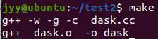
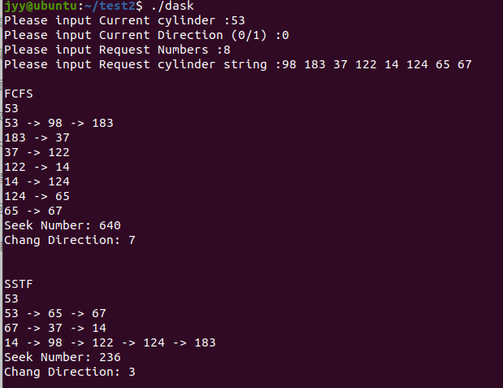
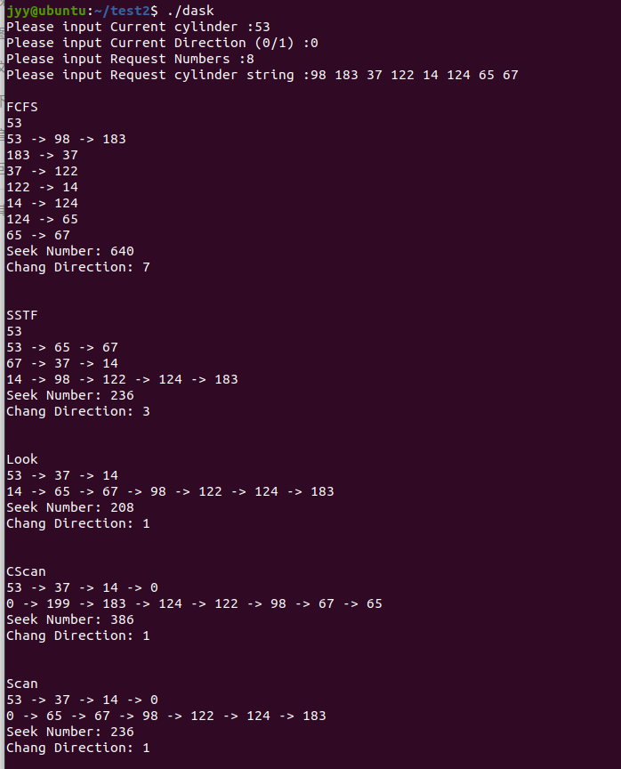
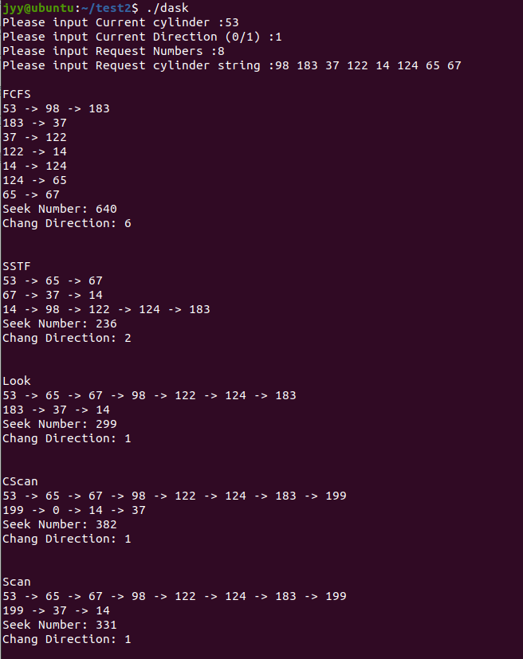
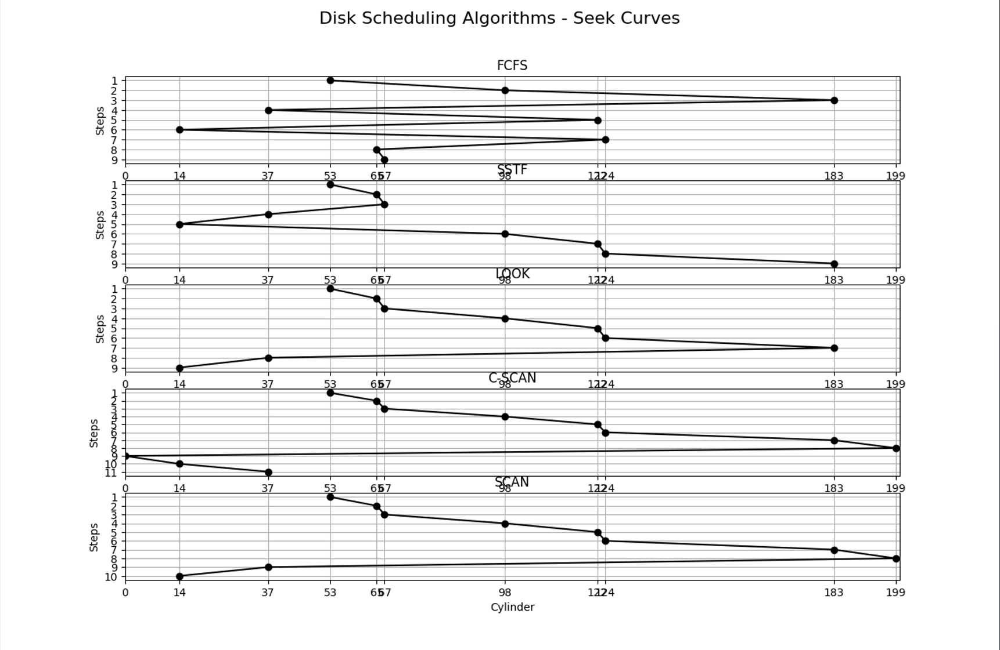

# 磁盘调度算法模拟实验

## 一：示例实验

-------------

示例实验程序中模拟两种磁盘移臂调度算法：SSTF 算法和 SCAN 算法

新建dask.h文件，代码如下

```
/* 
*  Filename          :  dask.h 
*  copyright         : (C) 2006 by zhonghonglie 
* Function           : 声明磁盘移臂调度类 
  
*/ 
#include <iostream> 
#include <iomanip> 
#include <malloc.h> 
using namespace std;
class DiskArm{ 
public: 
    DiskArm(); 
    ~DiskArm(); 
    void InitSpace(char * MethodName); //初始化寻道记录 
    void Report(void); // 报告算法执行情况 
    void Fcfs(void); //先来先服务算法 
    void Sstf(void);  //最短寻道时间优先算法 
    void Scan(void); //电梯调度算法 
    void CScan(void); //均匀电梯调度算法 
    void Look(void); //LOOK 调度算法 
private: 
    int *Request ;   //磁盘请求道号 
    int *Cylinder;   //工作柱面道号号 
    int RequestNumber;     //磁盘请求数 
    int CurrentCylinder;    //当前道号 
    int SeekDirection;    //磁头方向 
    int SeekNumber;    //移臂总数 
    int SeekChang;      //磁头调头数 
};
```

新建dask.cc文件，代码如下

```
/* 
  *  Filename          :  dask.cc 
  *  copyright         : (C) 2006 by zhonghonglie 
   * Function          : 磁盘移臂调度算法   
*/ 
 
#include "dask.h" 
DiskArm::DiskArm()
{ 
  int i; 
  //输入当前道号 
  cout << "Please input Current cylinder :" ; 
  cin >> CurrentCylinder;  
  //磁头方向，输入0表示向小道号移动，1表示向大道号移动 
  cout << "Please input Current Direction (0/1) :" ; 
  cin >> SeekDirection; 
  //输入磁盘请求数，请求道号 
  cout << "Please input Request Numbers :" ; 
  cin >> RequestNumber; 
  cout << "Please input Request cylinder string :"; 
  Request = new int[sizeof(int) * RequestNumber]; 
  Cylinder = new int[sizeof(int) * RequestNumber]; 
  for (i = 0; i < RequestNumber; i++) 
     cin >> Request[i];  
 } 
 
DiskArm::~DiskArm()
{ 
 
} 
//初始化道号，寻道记录 
void DiskArm::InitSpace(char * MethodName) 
{ 
  int i;  
  cout << endl <<  MethodName << endl; 
  SeekNumber = 0; 
  SeekChang = 0; 
  for (i = 0; i < RequestNumber; i++) 
       Cylinder[i] = Request[i]; 
} 
 
// 统计报告算法执行情况 
void DiskArm::Report(void)
{  
   cout << endl; 
   cout <<  "Seek Number: " << SeekNumber << endl; 
   cout <<  "Chang Direction: " << SeekChang << endl << endl; 
} 
 
//先来先服务算法 
void DiskArm::Fcfs(void) 
{ 
    int  Current = CurrentCylinder;  
    int  Direction = SeekDirection; 
    InitSpace("FCFS");   
 
    cout << Current; 
    for(int i=0;  i<RequestNumber; i++)
    { 
       if(((Cylinder[i] >= Current) && !Direction) 
        ||((Cylinder[i] <  Current) &&  Direction))
        { 
           //需要调头 
           SeekChang++;  //调头数加1 
           Direction = !Direction ; //改变方向标志 
           //报告当前响应的道号 
           cout  <<  endl << Current << " -> " << Cylinder[i];  
       } 
       else //不需调头，报告当前响应的道号 
          cout << " -> " << Cylinder[i] ;  
       //累计寻道数，响应过的道号变为当前道号 
       SeekNumber += abs(Current -Cylinder[i]); 
       Current = Cylinder[i]; 
   } 
  //报告磁盘移臂调度的情况 
   Report(); 
} 
 
//最短寻道时间优先算法 
void DiskArm::Sstf(void) 
{ 
    int  Shortest; 
    int  Distance = 999999 ; 
    int  Direction = SeekDirection; 
    int  Current = CurrentCylinder;  
    InitSpace("SSTF");   
    cout << Current; 
    for(int i=0; i<RequestNumber; i++)
    { 
        //查找当前最近道号 
       for(int j=0; j<RequestNumber; j++)
       { 
         if(Cylinder[j] == -1) continue; //-1表示已经响应过了 
         if(Distance  > abs(Current-Cylinder[j]))
         { 
            //到下一道号比当前距离近，下一道号为当前距离   
             Distance  = abs(Current-Cylinder[j]); 
            Shortest = j;  
         } 
        } 
      if((( Cylinder[Shortest] >= Current) && !Direction) 
        ||((  Cylinder[Shortest] < CurrentCylinder) && Direction))
        { 
            //需要调头 
            SeekChang++; //调头数加1 
           Direction = !Direction ; //改变方向标志 
           //报告当前响应的道号 
           cout  <<  endl <<  Current << " -> " <<  Cylinder[Shortest];  
       } 
       else //不需调头，报告当前响应的道号 
          cout << " -> " << Cylinder[Shortest] ;  
 
      //累计寻道数，响应过的道号变为当前道号 
       SeekNumber += abs(Current -Cylinder[Shortest]); 
      Current = Cylinder[Shortest]; 
      //恢复最近距离，销去响应过的道号  
      Distance = 999999;  
      Cylinder[Shortest] = -1;  
     } 
 
    Report(); 
         
} 
 
//电梯调度算法 
void DiskArm::Scan(void){ 
 
} 
 
//均匀电梯调度算法 
void DiskArm::CScan(void){ 
 
} 
 
//LOOK调度算法 
void DiskArm::Look(void)  
{ 
 
} 
//程序启动入口 
int main(int argc,char *argv[]){ 
 //建立磁盘移臂调度类 
  DiskArm *dask = new DiskArm(); 
  //比较和分析FCFS和SSTF两种调度算法的性能 
  dask->Fcfs(); 
  dask->Sstf(); 
}

//53
//0
//8
//98 183 37 122 14 124 65 67
```

新建makefile文件，代码如下：

```
head = dask.h 
srcs = dask.cc  
objs = dask.o 
opts = -w -g -c 
all:  dask 
dask: $(objs) 
	g++  $(objs) -o dask  
dask.o: $(srcs) $(head) 
	g++ $(opts) $(srcs)  
clean: 
	rm dask *.o 
```

使用`make`命令编译连接，生成可执行文件dask



执行`./dask`命令，输入当前道号，当前寻道方向，当前请求寻道数，当前请求寻
道的道号串，结果如下：

道号串为：98 183 37 122 14 124 65 67



## 二.独立实验

----------

在以上示例实验程序中补充 SCAN，C-SCAN，LOOK 磁盘移臂调度算法的模拟程序

将上述dask.cc完善为：

记得在头文件加入：`#include <algorithm>`

```
//电梯调度算法 
void DiskArm::Scan(void)
{ 
    int  Current = CurrentCylinder;  
    int  Direction = SeekDirection; 
    InitSpace("Scan");
    cout << Current;
    sort(Cylinder,Cylinder+RequestNumber);
    int s=0;
    for(int i=0;i<RequestNumber;i++)
    {
        if(Cylinder[i]<Current) continue;
        else
        {
            s=i;
            break;
        }
    }
    if(Direction)
    {
        for(int i=s;i<RequestNumber;i++)
        {
            cout << " -> " << Cylinder[i] ;
            //累计寻道数，响应过的道号变为当前道号 
            SeekNumber += abs(Current -Cylinder[i]);
            Current = Cylinder[i]; 
        }
        SeekNumber += abs(Current-199);
        cout << " -> " << 199;
        Current=199;
        if(s!=0)
        {
            //需要调头 
            SeekChang++; //调头数加1 
            Direction = !Direction ; //改变方向标志 
            //报告当前响应的道号 
            cout  <<  endl <<  Current << " -> " <<  Cylinder[s-1];
            SeekNumber += abs(199-Cylinder[s-1]);
            Current = Cylinder[s-1];
            for(int j=s-2;j>=0;j--)
            {
                cout << " -> " << Cylinder[j] ;
                //累计寻道数，响应过的道号变为当前道号 
                SeekNumber += abs(Current -Cylinder[j]);
                Current = Cylinder[j]; 
            }
        }
    }
    else
    {
        if(s!=0)
        {
            for(int i=s-1;i>=0;i--)
            {
                cout << " -> " << Cylinder[i] ;
                //累计寻道数，响应过的道号变为当前道号 
                SeekNumber += abs(Current -Cylinder[i]);
                Current = Cylinder[i]; 
            }
        }
        SeekNumber += abs(Current-0);
        cout << " -> " << 0;
        Current=0;
        //需要调头 
        SeekChang++; //调头数加1 
        Direction = !Direction ; //改变方向标志 
        //报告当前响应的道号 
        cout  <<  endl <<  Current << " -> " <<  Cylinder[s];
        SeekNumber += abs(0-Cylinder[s]);
        Current = Cylinder[s];
        for(int i=s+1;i<RequestNumber;i++)
        {
            cout << " -> " << Cylinder[i] ;
            //累计寻道数，响应过的道号变为当前道号 
            SeekNumber += abs(Current -Cylinder[i]);
            Current = Cylinder[i]; 
        }
    }
    Report(); 
} 
 
//均匀电梯调度算法 
void DiskArm::CScan(void)
{ 
    int  Current = CurrentCylinder;  
    int  Direction = SeekDirection; 
    InitSpace("CScan");
    cout << Current;
    sort(Cylinder,Cylinder+RequestNumber);
    int s=0;
    for(int i=0;i<RequestNumber;i++)
    {
        if(Cylinder[i]<Current) continue;
        else
        {
            s=i;
            break;
        }
    }
    if(Direction)
    {
        for(int i=s;i<RequestNumber;i++)
        {
            cout << " -> " << Cylinder[i] ;
            //累计寻道数，响应过的道号变为当前道号 
            SeekNumber += abs(Current -Cylinder[i]);
            Current = Cylinder[i]; 
        }
        SeekNumber += abs(Current-199);
        cout << " -> " << 199;
        Current=199;
        if(s!=0)
        {
            //需要调头 
            SeekChang++; //调头数加1 
            Direction = !Direction ; //改变方向标志 
            //报告当前响应的道号 
            cout  <<  endl <<  Current << " -> " <<  0;
            SeekNumber += abs(199-0);
            Current = 0;
            for(int j=0;j<=s-1;j++)
            {
                cout << " -> " << Cylinder[j] ;
                //累计寻道数，响应过的道号变为当前道号 
                SeekNumber += abs(Current -Cylinder[j]);
                Current = Cylinder[j]; 
            }
        }
    }
    else
    {
        if(s!=0)
        {
            for(int i=s-1;i>=0;i--)
            {
                cout << " -> " << Cylinder[i] ;
                //累计寻道数，响应过的道号变为当前道号 
                SeekNumber += abs(Current -Cylinder[i]);
                Current = Cylinder[i]; 
            }
        }
        SeekNumber += abs(Current-0);
        cout << " -> " << 0;
        Current=0;
        //需要调头 
        SeekChang++; //调头数加1 
        Direction = !Direction ; //改变方向标志 
        //报告当前响应的道号 
        cout  <<  endl <<  Current << " -> " <<  199;
        SeekNumber += abs(0-199);
        Current = 199;
        for(int i=RequestNumber-1;i>=s;i--)
        {
            cout << " -> " << Cylinder[i] ;
            //累计寻道数，响应过的道号变为当前道号 
            SeekNumber += abs(Current -Cylinder[i]);
            Current = Cylinder[i]; 
        }
    }
    Report(); 
} 
 
//LOOK调度算法 
void DiskArm::Look(void)  
{ 
    int  Current = CurrentCylinder;  
    int  Direction = SeekDirection; 
    InitSpace("Look");
    cout << Current;
    sort(Cylinder,Cylinder+RequestNumber);
    int s=0;
    for(int i=0;i<RequestNumber;i++)
    {
        if(Cylinder[i]<Current) continue;
        else
        {
            s=i;
            break;
        }
    }
    if(Direction)
    {
        for(int i=s;i<RequestNumber;i++)
        {
            cout << " -> " << Cylinder[i] ;
            //累计寻道数，响应过的道号变为当前道号 
            SeekNumber += abs(Current -Cylinder[i]);
            Current = Cylinder[i]; 
        }
        if(s!=0)
        {
            //需要调头 
            SeekChang++; //调头数加1 
            Direction = !Direction ; //改变方向标志 
            //报告当前响应的道号 
            cout  <<  endl <<  Current << " -> " <<  Cylinder[s-1];
            SeekNumber += abs(Current-Cylinder[s-1]);
            Current = Cylinder[s-1];
            for(int j=s-2;j>=0;j--)
            {
                cout << " -> " << Cylinder[j] ;
                //累计寻道数，响应过的道号变为当前道号 
                SeekNumber += abs(Current -Cylinder[j]);
                Current = Cylinder[j]; 
            }
        }
    }
    else
    {
        if(s!=0)
        {
            for(int i=s-1;i>=0;i--)
            {
                cout << " -> " << Cylinder[i] ;
                //累计寻道数，响应过的道号变为当前道号 
                SeekNumber += abs(Current -Cylinder[i]);
                Current = Cylinder[i]; 
            }
        }
        //需要调头 
        SeekChang++; //调头数加1 
        Direction = !Direction ; //改变方向标志 
        //报告当前响应的道号 
        cout  <<  endl <<  Current << " -> " <<  Cylinder[s];
        SeekNumber += abs(Current-Cylinder[s]);
        Current = Cylinder[s];
        for(int i=s+1;i<RequestNumber;i++)
        {
            cout << " -> " << Cylinder[i] ;
            //累计寻道数，响应过的道号变为当前道号 
            SeekNumber += abs(Current -Cylinder[i]);
            Current = Cylinder[i]; 
        }
    }
    Report(); 
} 
```

结果如下：



## 三：实验分析

-----------------

### 1.说明您做了哪些磁盘请求序列的测试，发现了哪些现象？



根据两次实验对比，得出如下结论


1.FCFS是一种简单的调度算法，但寻道次数和调头次数都较高。对于随机的请求顺序，FCFS不能优化寻道路径，导致性能较低。这种算法在对序列顺序敏感的应用中可以提供一定优势，但整体效率较低。


2.SSTF的优点是显著减少寻道次数，表现优于其他算法。然而，它可能会导致饥饿现象，即离当前柱面较远的请求可能长时间得不到服务。尽管如此，对于整体寻道效率的优化效果显著。


3.LOOK算法在实验1中表现出最低的寻道次数，接近SSTF。它在调头次数上也较少，但相比于SSTF，LOOK在避免饥饿现象上更具优势。它适合在减少寻道时间和避免饥饿现象之间寻找平衡。


4。C-SCAN将磁头调度的公平性提升，但由于每次都需要扫描到极端柱面，寻道次数相对较高。在有明确公平性需求的场景中，C-SCAN的表现相对稳定，但寻道效率较低。


5.SCAN算法在一定程度上减少了饥饿现象，并且在寻道次数上较为接近SSTF。与LOOK相比，SCAN在一些场景中表现出更好的公平性，而LOOK则更偏向于优化寻道时间。

### 2.选择一些典型磁盘请求序列的响应结果，画出不同算法中的寻道曲线图。

如图，



结论如下：

- **FCFS**: 曲线变化剧烈，寻道时间较长。
- **SSTF**: 曲线较为平滑，减少了寻道时间。
- **LOOK**: 类似于 SCAN，但不扫到极端位置，较均衡。
- **C-SCAN**: 循环扫描，保证了公平性，但可能增加寻道时间。
- **SCAN**: 扫描到极端位置再返回，较均衡但可能出现极端选择。

### 3.说明您的程序是怎样模拟SCAN 等算法的？

### SCAN 调度算法（也叫电梯算法）

1. **排序请求**：函数开始时，把磁盘请求进行排序。
2. 向上处理请求
   - 如果当前方向是向上（`SeekDirection`为1），那么从当前磁盘位置开始，沿当前方向处理每一个请求，直到最后一个请求。
   - 如果所有请求处理完，但还有一些未处理的请求，那么将磁盘头移动到磁盘的顶端（199柱面）。
   - 然后改变方向，从磁盘顶端反向处理所有剩余的请求。
3. 向下处理请求
   - 如果当前方向是向下（`SeekDirection`为0），那么从当前磁盘位置开始，沿当前方向处理每一个请求，直到第一个请求为止。
   - 如果所有请求处理完，但还有一些未处理的请求，那么将磁盘头移动到磁盘的底端（0柱面）。
   - 然后改变方向，从磁盘底端反向处理所有剩余的请求。

### C-SCAN 调度算法（循环电梯算法）

1. **排序请求**：函数开始时，把磁盘请求进行排序。
2. 向上处理请求
   - 如果当前方向是向上（`SeekDirection`为1），那么从当前磁盘位置开始，沿当前方向处理每一个请求，直到最后一个请求。
   - 然后将磁盘头移到顶端（199柱面），直接跳回到磁盘的底端（0柱面）。
   - 继续从0柱面开始处理上次遗漏的请求。
3. 向下处理请求
   - 如果当前方向是向下（`SeekDirection`为0），那么从当前磁盘位置开始，沿当前方向处理每一个请求，直到第一个请求为止。
   - 然后将磁盘头移到底端，直接跳回顶端（199柱面）。
   - 继续从199柱面开始处理上次遗漏的请求。

### LOOK 调度算法

LOOK算法和SCAN算法类似，不同的是，LOOK算法并不会把磁盘头移动到磁盘的顶端或底端，只会处理到请求的最远端。

1. **排序请求**：函数开始时，把磁盘请求进行排序。
2. 向上处理请求
   - 如果当前方向是向上（`SeekDirection`为1），那么从当前磁盘位置开始，沿当前方向处理每一个请求，直到所有在当前方向上的请求处理完毕。
   - 然后改方向，处理剩下的请求（此时不移到顶端）。
3. 向下处理请求
   - 如果当前方向是向下（`SeekDirection`为0），那么从当前磁盘位置开始，沿当前方向处理每一个请求，直到所有在当前方向上的请求处理完毕。
   - 然后改方向，处理剩下的请求（此时不移到底端）。

### 4.综合分析实验结果中各种算法各适应于怎样的磁盘柱面寻道请求情况。

### 1. FCFS（First Come First Serve）

#### 特点：

- 最简单的调度算法，按照请求到达的顺序依次处理。
- 不考虑距离或方向，导致寻道可能非常不优化。

#### 适用场景：

- 请求到达率较低的情况，磁盘请求不密集。
- 对寻道时间不敏感的场景，且不希望有复杂的调度逻辑。
- 不在意寻道效率，强调请求按顺序处理的公平场景。

### 2. SSTF（Shortest Seek Time First）

#### 特点：

- 优先处理与当前磁头位置最接近的请求。
- 在大多数情境下可以减少平均寻道时间。

#### 适用场景：

- 磁盘请求较为密集且分布较随机的情况。
- 对寻道时间较敏感，希望减少平均寻道时间的场景。
- 适用于主机系统负载比较重，频繁访问磁盘的应用。

#### 缺点：

- 容易导致某些远距离请求长期得不到处理，即“饥饿”（starvation）现象。

### 3. SCAN（Elevator Algorithm）

#### 特点：

- 来回扫描磁盘，磁头在一个方向上移动到最远端后再转向。
- 平衡性好，比较适合于请求较为分散和均匀的场景。

#### 适用场景：

- 请求分布相对均匀，多数请求都能得到较快速响应。
- 避免饥饿的场景，希望保证所有请求都能被轮流处理。

#### 缺点：

- 在反转方向时可能会带来额外的寻道时间，尤其在请求集中在磁盘两端时。

### 4. C-SCAN（Circular SCAN）

#### 特点：

- 类似于SCAN算法，但只单向扫描，扫描到最远端后直接跳回起点（类似环形）。
- 更加均匀地处理请求，减少长时间等待。

#### 适用场景：

- 请求分布非常广泛，较均匀分布的情况。
- 对响应时间要求较高，希望避免长时间等待的场景。
- 系统对磁盘响应的一致性有较高要求的应用场景。

### 5. LOOK

#### 特点：

- 类似于SCAN算法，但只扫描到最远的请求位置，不会到达磁盘的物理极限。
- 减少不必要的寻道操作，平均寻道时间通常比SCAN更短。

#### 适用场景：

- 请求集中在某一小范围或相对集中区域。
- 对平均寻道时间要求较高的情况，希望尽量减少不必要的寻道操作。

### 综合分析

通过实验可以看到，不同调度算法在不同情况下的表现：

- **FCFS**适合于请求到达率较低、寻道时间不敏感的场景。
- **SSTF**适用于请求密集分布较随机的场景，可以有效降低平均寻道时间，但需要注意避免“饥饿”问题。
- **SCAN**适合请求分布较均匀的情况，能有效避免某些柱面长时间不被访问的问题。
- **C-SCAN**适合请求广泛且均匀分布的情况，能提供较一致的响应时间。
- **LOOK**算法在请求集中于某一小区域或相对集中的情况下表现优异，可以减少不必要的寻道操作。