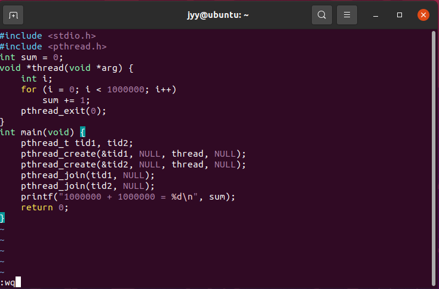
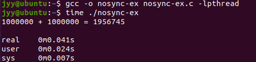
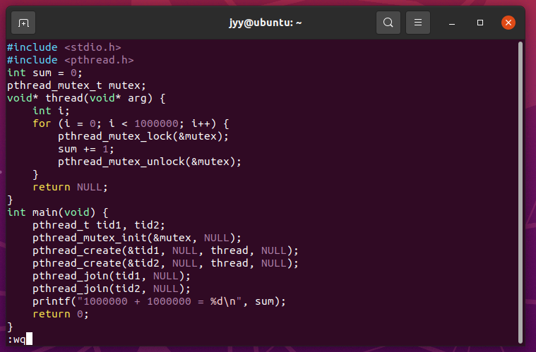
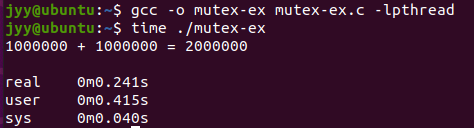
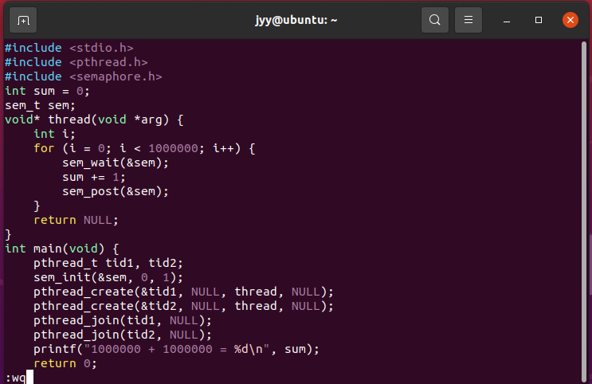
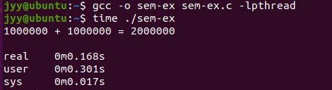
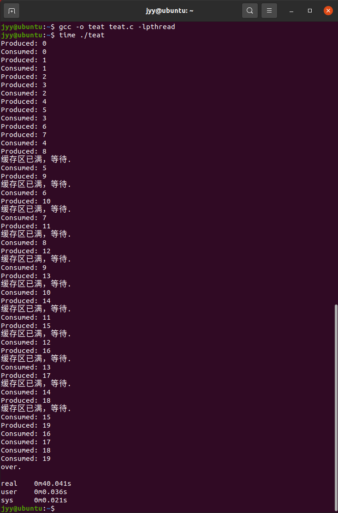

# Linux下多线程编程实践

## 任务2.1：熟悉API

---------

#### 1.建立一个无需同步的多线程程序：nosync-ex.c

首先使用vim命令创建一个nosync-ex.c文件

`vim nosync-ex.c`

然后自动会进入编辑界面，将代码填入后使用`：wq`来保存（此后将不会再赘述这部分内容）

`#include <stdio.h>`
`#include <pthread.h>`
`int sum = 0;`
`void *thread(void *arg) {`
    `int i;`
    `for (i = 0; i < 1000000; i++)`
        `sum += 1;`
    `pthread_exit(0);`
`}`
`int main(void) {`
    `pthread_t tid1, tid2;`
    `pthread_create(&tid1, NULL, thread, NULL);`
    `pthread_create(&tid2, NULL, thread, NULL);`
    `pthread_join(tid1, NULL);`
    `pthread_join(tid2, NULL);`
    `printf("1000000 + 1000000 = %d\n", sum);`
    `return 0;`
`}`

接下来使用`gcc -o nosync-ex nosync-ex.c -lpthread`命令就行编译 `time ./nosync-ex`命令运行文件

如图，1000000+1000000的结果是错误的，其原因是因为`sum` 变量被两个线程共享。每个线程都会对 `sum` 进行递增操作，导致了数据竞争的问题，从而使得结果不可预期，通过这部分的学习我们将会明白线程设计中互斥锁的重要性。

#### 2.Mutex的使用(mutex-ex.c)

文件代码如下

`#include <stdio.h>`
`#include <pthread.h>`
`int sum = 0;`
`pthread_mutex_t mutex;`
`void* thread(void* arg) {`
    `int i;`
    `for (i = 0; i < 1000000; i++) {`
        `pthread_mutex_lock(&mutex);`
        `sum += 1;`
        `pthread_mutex_unlock(&mutex);`
    `}`
    `return NULL;`
`}`
`int main(void) {`
    `pthread_t tid1, tid2;`
    `pthread_mutex_init(&mutex, NULL);`
    `pthread_create(&tid1, NULL, thread, NULL);`
    `pthread_create(&tid2, NULL, thread, NULL);`
    `pthread_join(tid1, NULL);`
    `pthread_join(tid2, NULL);`
    `printf("1000000 + 1000000 = %d\n", sum);`
    `return 0;`
`}`

使用以下命令完成编译运行

`gcc –o mutex-ex mutex-ex.c -lpthread`
`time ./mutex-ex`

#### 3.Semaphore的使用(sem-ex.c)

文件代码如下

`#include <stdio.h>`
`#include <pthread.h>`
`#include <semaphore.h>`

`int sum = 0;`
`sem_t sem;`

`void* thread(void *arg) {`
    `int i;`
    `for (i = 0; i < 1000000; i++) {`
        `sem_wait(&sem);`
        `sum += 1;`
        `sem_post(&sem);`
    `}`
    `return NULL;`
`}`

`int main(void) {`
    `pthread_t tid1, tid2;`
    `sem_init(&sem, 0, 1);`
    `pthread_create(&tid1, NULL, thread, NULL);`
    `pthread_create(&tid2, NULL, thread, NULL);`
    `pthread_join(tid1, NULL);`
    `pthread_join(tid2, NULL);`
    `printf("1000000 + 1000000 = %d\n", sum);`
    `return 0;`
`}`

`gcc -o sem-ex sem-ex.c -lpthread`
`time ./sem-ex`

## 任务2.2 基于⽰例中涉及到的线程同步API，实现⽣产者消费者问题

------

为了实现比较简单的生产者消费者问题，我们必须使用互斥锁和条件变量来确保生产者和消费者线程之间的同步和协作。

以下的代码实现了简单的一个生产者消费者模型，我将以注释的形式逐句详细解释

`#include <stdio.h>`
`#include <pthread.h>`
`#include <unistd.h>`

`#define BUFFER_SIZE 5`//将缓存区大小设置为5
`#define NUM_ITEMS 20`//生成的数据个数设为20

`int buffer[BUFFER_SIZE];`//定义一些简单的全局变量
`int in = 0, out = 0;`//输入和输出，默认为0
`pthread_mutex_t mutex;`//设置互斥锁
`pthread_cond_t buffer_not_full, buffer_not_empty;`//设置对缓冲区空，满的变量

`void* producer(void* arg) {`//生产者线程函数
    `for (int i = 0; i < NUM_ITEMS; i++) {`
        `pthread_mutex_lock(&mutex);`//在访问共享资源前为资源上锁
        `while (((in + 1) % BUFFER_SIZE) == out) {`//如果缓冲区已满，则循环等待
            `printf("缓存区已满，等待.\n");`
            `pthread_cond_wait(&buffer_not_full, &mutex);`//在条件变量上等待，并且在等待期间会释放相应的互斥锁，避免死锁，直到变量显示缓冲区不为满
        `}`
        `buffer[in] = i;`//将生产的数据填入缓冲区
        `in = (in + 1) % BUFFER_SIZE;`//更新下一个输入位置
        `printf("Produced: %d\n", i);`
        `pthread_cond_signal(&buffer_not_empty);`//向条件变量发送信号，通知等待在该条件变量上的线程可以继续执行了
        `pthread_mutex_unlock(&mutex);`//用完了把锁解开
        `sleep(1);`//为了避免生产一个拿走一个的情况发生，也是为了模拟实际所以生产者只休息一秒
    `}`
    `pthread_exit(NULL);`//线程结束并退出
`}`

`void* consumer(void* arg) {`//消费者线程函数（思路同上）
    `for (int i = 0; i < NUM_ITEMS; i++) {`
        `pthread_mutex_lock(&mutex);`
        `while (in == out) {`
            `printf("缓存区为空，等待.\n");`
            `pthread_cond_wait(&buffer_not_empty, &mutex);`
        `}`
        `int item = buffer[out];`
        `out = (out + 1) % BUFFER_SIZE;`
        `printf("Consumed: %d\n", item);`
        `pthread_cond_signal(&buffer_not_full);`
        `pthread_mutex_unlock(&mutex);`
        `sleep(2);`//为了避免产一拿一的情况，也是为了模拟真实情况，消费者休眠两秒
    `}`
    `pthread_exit(NULL);`
`}`

`int main() {`
    `pthread_t producer_thread, consumer_thread;`
``    

`pthread_mutex_init(&mutex, NULL);`// 初始化互斥锁和条件变量
`pthread_cond_init(&buffer_not_full, NULL);`
`pthread_cond_init(&buffer_not_empty, NULL);`

`pthread_create(&producer_thread, NULL, producer, NULL);`// 创建生产者和消费者线程
`pthread_create(&consumer_thread, NULL, consumer, NULL);`

`pthread_join(producer_thread, NULL);`//等待生产者和消费者线程运行完毕
`pthread_join(consumer_thread, NULL);`

`printf("over.\n");`//两个线程结束后显示结束
`return 0;`

`}`

运行结果如下

